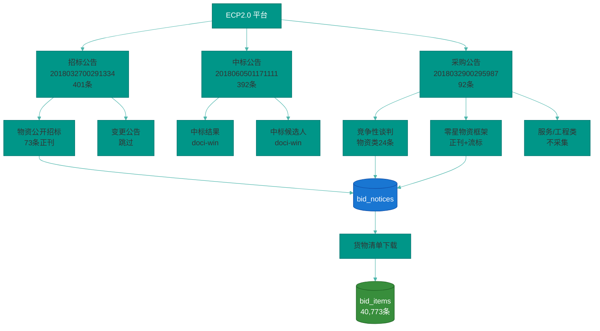
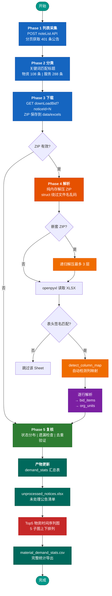
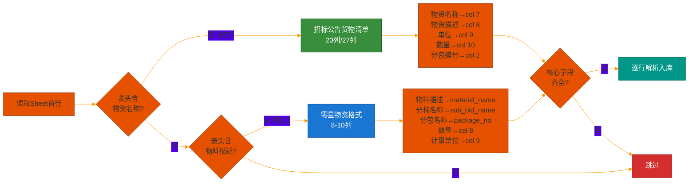
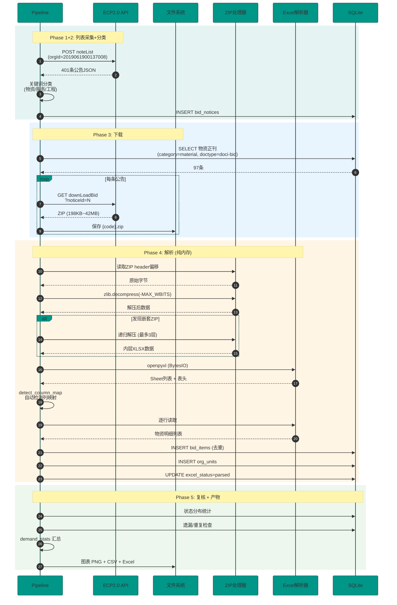
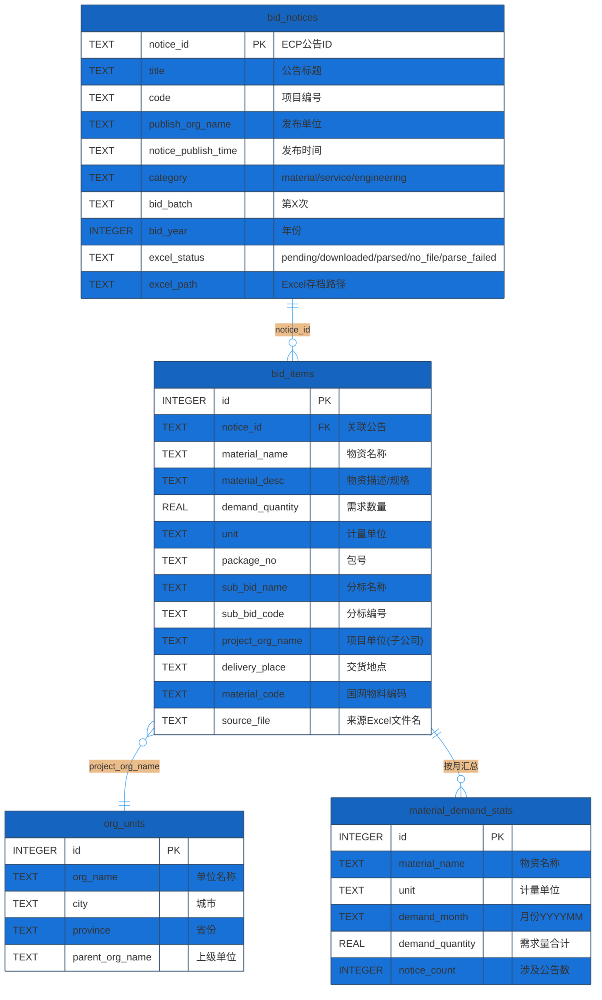
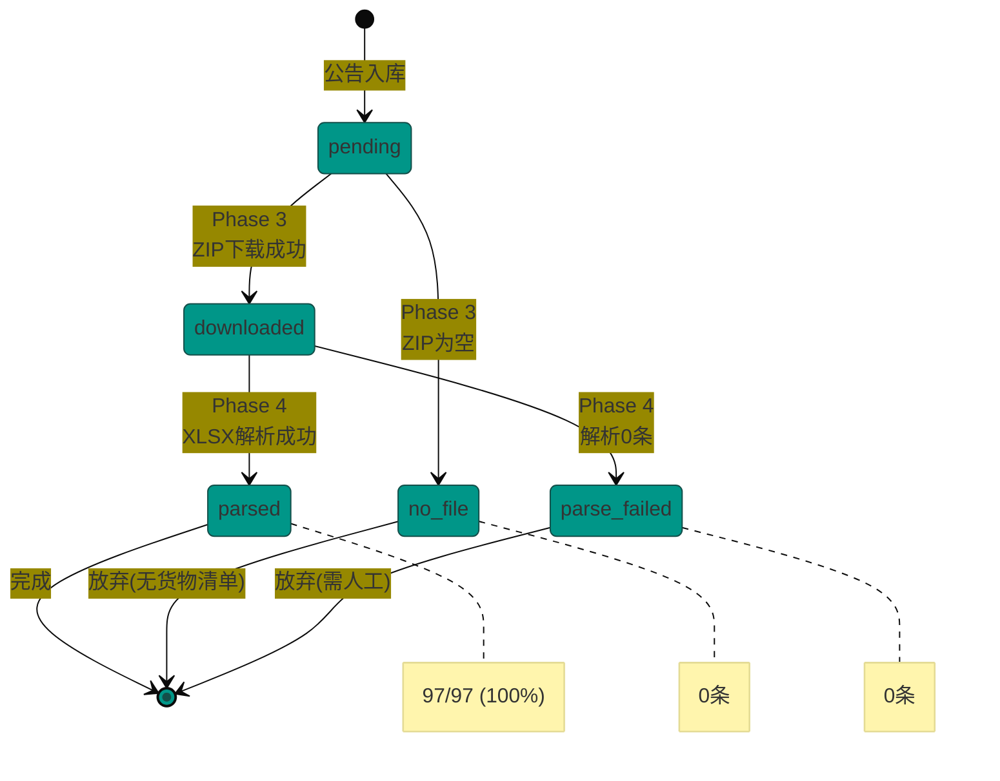

# bidding-ecp-data

国网新一代电子商务平台 (ECP2.0) 物资采购数据采集与分析系统。无需登录即可获取国网冀北电力有限公司（含全部子公司）历年物资招标采购的货物清单明细数据。

## 工程结构

```
bidding-ecp-data/
├── reports/
│   └── verification_report.md        # 验证报告
├── data/
│   ├── ecp_data.db                   # SQLite 数据库 (97公告 + 4万+物资 + 1500+单位)
│   ├── excels/                       # 货物清单 Excel 存档
│   └── unprocessed_notices.xlsx      # 未处理公告清单 (自动生成)
├── outputs/
│   ├── figures/
│   │   └── material_demand_top5_monthly.png  # Top5 物资需求趋势图
│   └── material_demand_stats.csv     # 物资需求统计 CSV
└── src/
    ├── crawler/
    │   └── ecp_client.py             # ECP API 客户端
    ├── db/
    │   └── schema.py                 # 数据库表结构
    ├── pipeline.py                   # 主流水线 (5阶段)
    └── demand_stats.py               # 需求统计 + 绘图
```

## 业务功能

本系统围绕国网冀北电力有限公司的物资采购数据，提供**采集 → 解析 → 存储 → 统计 → 可视化**全链路能力。

### 数据覆盖

| 维度 | 范围 |
|------|------|
| 时间跨度 | 2020年5月 ~ 2026年6月 (6年+) |
| 公告总数 | 492 条 (招标公告 + 采购公告) |
| 物资正刊 | 97 条 |
| 物资明细 | 40,773 条 |
| 设备种类 | 2,000+ 种 |
| 项目单位 | 1,514 个 (覆盖唐山/承德/张家口/秦皇岛/廊坊/北京) |

### 核心数据字段

| 字段 | 说明 | 示例 |
|------|------|------|
| `material_name` | 物资名称 | `交流避雷器,AC10kV,复合,无间隙` |
| `material_desc` | 物资描述/规格 | `YH5WS-17/50` |
| `demand_quantity` | 需求数量 | `329` |
| `unit` | 计量单位 | `台` / `套` / `千米` / `吨` |
| `package_no` | 包号 | `包1` |
| `sub_bid_name` | 分标名称 | `变压器` / `组合电器` / `避雷器` |
| `project_org_name` | 项目单位 | `国网冀北电力有限公司唐山供电公司` |
| `delivery_place` | 交货地点 | `河北省唐山市` |

### 三类公告数据源



## 安装与运行

```bash
pip install requests openpyxl matplotlib

# 增量模式 (仅处理新增/未解析的公告)
python src/pipeline.py

# 全量模式 (重新下载全部ZIP)
python src/pipeline.py --full

# 仅复核检查
python src/pipeline.py --verify

# 独立运行需求统计 + 绘图
python src/demand_stats.py
```

## 代码流程图

### 主流水线 (5阶段)



### Excel 列映射自动检测



## 数据采集时序图



## 数据表结构



## excel_status 状态流转



## 关键API接口

| 接口 | 方法 | 认证 | 用途 |
|------|------|------|------|
| `/ecpwcmcore//index/noteList` | POST | 无需 | 公告列表 (3个菜单ID) |
| `/ecpwcmcore//index/downLoadBid?noticeId=` | GET | 无需 | 下载货物清单ZIP |
| `/ecpwcmcore//index/getNoticeBid` | POST | 需登录 | 公告详情 (未使用) |

### 菜单ID

| 菜单 | ID | 冀北公告数 |
|------|-----|----------|
| 招标公告 | `2018032700291334` | 401 |
| 中标公告 | `2018060501171111` | 392 |
| 采购公告 | `2018032900295987` | 92 |

## 技术要点

### 纯内存ZIP解压

ECP货物清单ZIP的文件名使用GBK编码，Python `zipfile` 模块无法正确处理（`BadZipFile`异常）。解决方案：

1. 使用 `struct` 直接读取ZIP header偏移量，绕过文件名编码校验
2. `zlib.decompress(data, -zlib.MAX_WBITS)` 处理Deflate压缩
3. 递归处理嵌套ZIP（采购公告类型ZIP内含另一个ZIP，最多3层）

### 两种Excel格式兼容

| 特性 | 招标公告格式 | 零星物资格式 |
|------|------------|------------|
| 表头签名 | `物资名称` | `物料描述` |
| 列数 | 23/27列 | 8-10列 |
| 单位列名 | `单位` | `计量单位` |
| 分标来源 | Sheet名 | 分标名列 |
| 数量列 | col 10 | col 8 |
| 示例 | 公开招标/协议库存 | 竞争性谈判/零星框架 |

### 去重机制

```sql
CREATE UNIQUE INDEX idx_items_unique ON bid_items(
    notice_id, COALESCE(sub_bid_code,''), COALESCE(sub_bid_name,''),
    COALESCE(package_no,''), COALESCE(material_name,'')
);
```

同一公告+分标+包号+物资名 → 自动跳过重复插入。

## 数据库状态

| 表 | 记录数 | 说明 |
|----|--------|------|
| `bid_notices` | 492 | 冀北全部公告 |
| `bid_items` | 40,773 | 物资明细 |
| `org_units` | 1,514 | 项目单位 (含县区分公司) |
| `material_demand_stats` | 5,839 | 物资需求按月汇总 |

### 解析状态

| 状态 | 数量 | 说明 |
|------|------|------|
| `parsed` | 97 | 物资正刊全部解析成功 |
| `pending` | 395 | 服务/变更/特殊文档 (无物资数据) |
