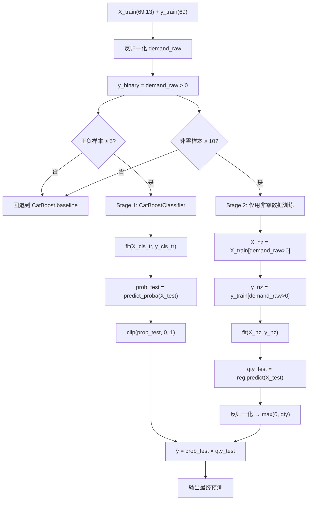

# 两阶段预测模型 (TwoStage)

## 一、动机

电力物资月度需求数据有 36-38% 的月份为零值。这些零值月不是"需求真的为零"，而是"该月没有发布包含该物资的招标公告"。

直接用一个回归模型去预测需求量的两个典型问题：
1. **模型被零值主导**：MSE 优化目标下，预测零值比预测实际需求量更安全，模型倾向于压低预测值
2. **信号混淆**："某月有没有需求"和"如果有，需求是多少"是两个不同的问题，强行用一个回归器同时回答两者会导致两者都答不好

## 二、核心思路

将月度需求预测拆解为两个独立子任务：

```
Stage 1 (分类):  这个月会有需求吗？→ 输出概率 P ∈ [0,1]
Stage 2 (回归):  如果有需求，量是多少？→ 输出预测量 Q
最终预测       :  ŷ = P × Q
```

如果 Stage 1 判断某月极大概率无需求（P → 0），则最终预测也趋于 0。
如果 Stage 1 判断有需求（P → 1），则最终预测主要由 Stage 2 决定。

## 三、数学描述

给定训练集 $(X_{train}, y_{train})$ 和测试集 $X_{test}$：

### Stage 1: 二分类器

$$b_i = \mathbb{1}[y_i > 0], \quad i = 1, \ldots, n_{train}$$

$$h_{cls}(X) = \text{CatBoostClassifier}(\text{iterations}=800, \text{depth}=5, \text{loss}=\text{Logloss})$$

$$P_j = h_{cls}(X_{test}^{(j)}) \quad \text{(样本有需求的预测概率)}$$

### Stage 2: 回归器

仅使用训练集中**非零月份**的数据训练回归器：

$$X_{nz} = \{X_{train}^{(i)} \mid y_i > 0\}, \quad y_{nz} = \{y_{train}^{(i)} \mid y_i > 0\}$$

$$h_{reg}(X) = \text{CatBoostRegressor}(\text{iterations}=1500, \text{depth}=6, \text{loss}=\text{RMSE})$$

$$Q_j = h_{reg}(X_{test}^{(j)})$$

### 最终预测

$$\hat{y}_j = P_j \times \max(Q_j, 0)$$

### 安全退路

当训练数据不满足条件时，自动回退到单阶段 CatBoost baseline：

```python
if n_pos < 5 or n_neg < 5:
    return run_catboost(...)      # 分类正负样本不均衡
if nonzero_mask.sum() < 10:
    return run_catboost(...)      # 非零样本过少无法训练回归器
```

## 四、代码实现

核心代码位于 `vmd-catboost/main.py` 的 `run_two_stage()` 函数，约 55 行。

### 4.1 完整流程



### 4.2 超参数

| 阶段 | 参数 | 值 | 说明 |
|------|------|-----|------|
| Stage 1 | 模型 | CatBoostClassifier | 原生支持二分类 |
| | iterations | 800 | 分类任务更简单，不需要太多迭代 |
| | depth | 5 | 较浅的树防止过拟合 |
| | l2_leaf_reg | 5 | 较强正则化 |
| | loss_function | Logloss | 对数损失，适合概率输出 |
| | early_stopping | 30 | 验证集上不再改善则提前停止 |
| Stage 2 | 模型 | CatBoostRegressor | 同 baseline |
| | iterations | 1500 | 回归任务需更多迭代 |
| | depth | 6 | 同 baseline |
| | loss_function | RMSE | 均方根误差 |
| | 训练数据 | 仅非零月(~42月) | 避免零值干扰回归器 |

## 五、实验结果

在 5 种物资上对比了 CatBoost（单阶段回归）和 TwoStage（两阶段）：

| 物资 | CatBoost R² | TwoStage R² | 提升 |
|------|:---:|:---:|:---:|
| 交流避雷器 | 0.33 | **0.51** | +55% |
| 电容式电压互感器 | 0.51 | **0.72** | +41% |
| 交流支柱绝缘子 | 0.53 | **0.76** | +43% |
| 断路器保护 | 0.62 | 0.17 | 下降 |
| 电抗器保护 | 0.80 | 0.68 | 下降 |

### 为什么大需求量物资提升明显，小需求量物资反而下降？

| 物资 | 非零月数 | 月均需求量 | TwoStage 效果 | 分析 |
|------|:---:|:---:|:---:|------|
| 交流避雷器 | 52 | ~1,484 | ✅ +55% | 分类器有效区分有/无需求月 |
| 电容式电压互感器 | 52 | ~175 | ✅ +41% | 同上 |
| 交流支柱绝缘子 | 50 | ~1,358 | ✅ +43% | 同上 |
| 断路器保护 | 50 | ~24 | ❌ | 非零样本需求量太小，回归器拟合差 |
| 电抗器保护 | 50 | ~16 | ❌ | 同上 |

**规律**：TwoStage 对大需求量物资有效（月均 >100），因为 Stage 2 的非零样本回归质量高。对于小需求量物资（月均 <30），42 个非零样本的波动本身就大，拆分为两个阶段后各阶段的误差反而被放大。

## 六、论文中如何呈现

### 6.1 适用场景
- 适合有 30%+ 零值率的时间序列预测问题
- 特别适合零值来自"事件是否发生"（如本月是否有招标批次）而非"真实需求为零"的场景
- 论文中可定位为"处理间歇性需求的轻量级方法"

### 6.2 与已有方法的区别

| 方法 | 核心思路 | 与本方法的关系 |
|------|---------|-------------|
| Croston 方法 | 分解为需求间隔 × 需求规模 | 思想相近但 Croston 用指数平滑，本方法用梯度提升树 |
| Hurdle 模型 | 零截尾泊松 / 逻辑回归 + 泊松 | 同一范式，但我们的 Stage 2 不限定分布族 |
| Zero-Inflated 模型 | 混合分布 P(0) + (1-P(0))×f(y) | 更通用但假设更强，我们的方法更工程化 |

### 6.3 论文中的表述建议

> 针对电力物资月度需求中普遍存在的高零值率问题（36-38%），本文提出了一种两阶段预测框架：第一阶段使用 CatBoostClassifier 预测当月是否有采购活动发生，输出概率 P；第二阶段仅使用历史非零月份数据训练 CatBoostRegressor 预测需求量 Q；最终预测值为 P × Q。该方法将"是否有需求"和"需求量多少"两个性质不同的问题解耦，避免了单阶段回归器被大量零值主导的困境。

## 七、局限性

1. **小需求物资退化**：当月均需求量 <30 时，两阶段可能劣于单阶段
2. **分类器和回归器独立训练**：两个模型之间没有联合优化，P × Q 的乘积可能不是最优的
3. **零值类型假设**：假设所有零值都是"无采购事件"，如果存在"有事件但需求被取消/合并"的零值，Stage 1 的分类边界会模糊
